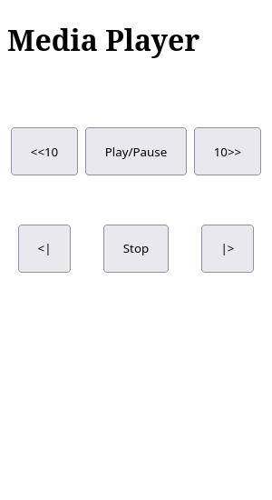

# HTTP Remote

A flexible remote control, powered by shell commands and a simple web interface.



_Remote control opened on a smartphone_

> [!CAUTION]
> This tool uses unauthenticated and unencrypted communication! See [Security](#security) for more details.

## Usage

This program can run in two modes:

- Standalone (run indefinitely): `http-remote`
- As a wrapper (exit after the provided command finished execution): `http-remote <command>`

After startup, the program will display a URL as well as an QR code to access the remote control web interface.

> [!NOTE]
> Similar to `watch` and other CLI tools, running this tool in wrapper mode should be mostly fine, but some complex commands might lead to some quirky behavior.
>
> You might need to fiddle around to get them working correctly. When in doubt, wrapping your whole command in parentheses and/or escaping special characters might help.

## Configuration

On first startup, an [example configuration](config.toml) will be generated. You can adjust and enhance this to your needs (restart the program afterward).

Buttons are configured by just providing a shell command and a display name, allowing for flexible configuration and various use cases.

### Example - Media Player

[Configuration](config.toml)

This is the original use case that this tool was created for. It uses the ipc socket feature of `mpv` to create a remote controlled media player. This can be useful for multiple scenarios:

- Remote control a computer that is hooked up to a TV to play a movie
- Remote control music that is playing from a computer hooked up to a speaker
- Remote control a slide show
  - (You can provide a directory of pictures to `mpv` and it will display them as a slideshow)
  - If you add `--pause` to the mpv command or manually pause the slideshow, you can use the previous/next track buttons to manually switch between pictures

Add `--input-ipc-server=~~/socket` to your usual mpv command to enable the socket. A full command might look like this:

```shell
http-remote mpv --input-ipc-server=~~/socket "https://www.youtube.com/watch?v=dQw4w9WgXcQ"
```

## Security

In general, treat this tool the same way you would treat a regular remote control. Play/Pause music is fine, but maybe you shouldn't hook up a chainsaw to this.

This tool is meant for simple use cases - likely in a home network with a low thread level - and should be straight-forward to use. Thus, some compromises were made. Please note the following security limitations.

### No HTTPS

The way SSL certificates and chains of trust work today, makes them unviable for this use case. You would either have to:

- Buy and set up a proper domain; acquire a public-trust certificate
- Create a self-signed certificate and configure all involved devices accordingly
- Create a self-signed certificate and ignore certificate warnings everytime you use the remote control webpage

Considering the intended use case, we simply refrain from using encryption. This should be fine for small home networks where there are only a handful of (hopefully trustworthy) devices.

### No Authentication

Similar to a regular remote control, you just want to pick this up and use it without being bothered by a login. This is why there is no authentication (which would also be kind of pointless without transport encryption).

The exact remote control URL is randomized by default, which at least hinders access by uninvited third parties. But as with any regular remote control, hidden behind the sofa, once it is found, anyone with access can use it (which often is actually a feature).

### Remote Code Execution by Design

This software is quite literally [remote code execution](https://en.wikipedia.org/wiki/Arbitrary_code_execution) by design, so keep that in mind while configuring. It's up to you which commands are available to anyone at the simple press of a button.

Currently, this software doesn't allow for parameters or templating, you can only specify static commands. This should limit how much you can shoot yourself in the foot, but it won't prevent you from doing so.
